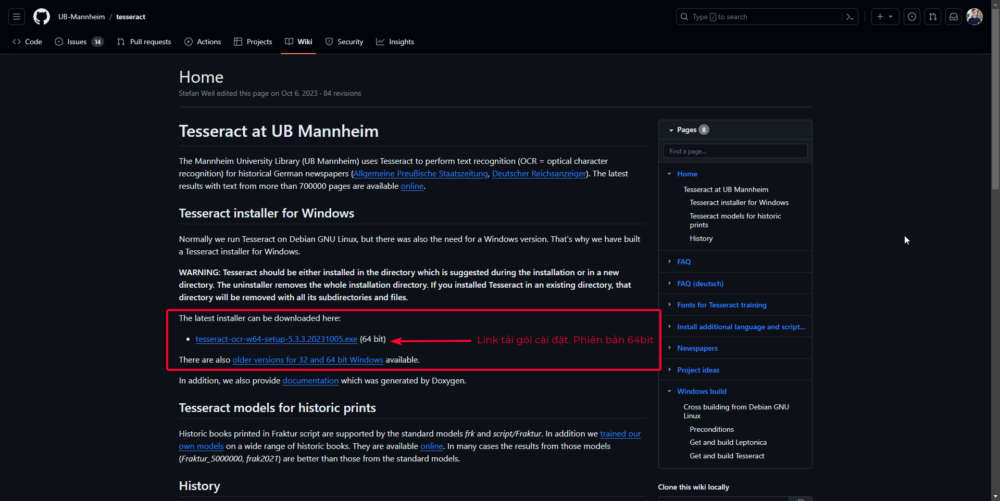
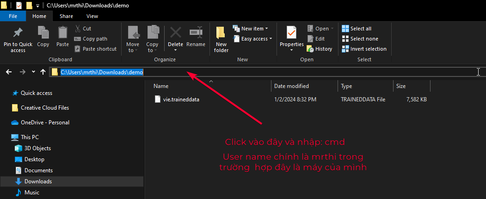
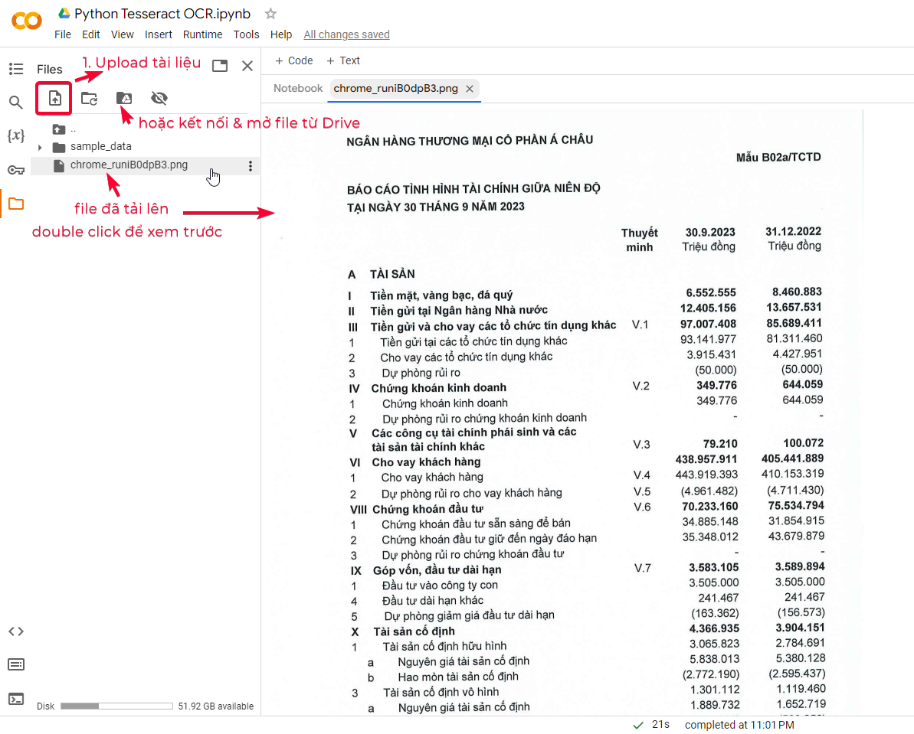
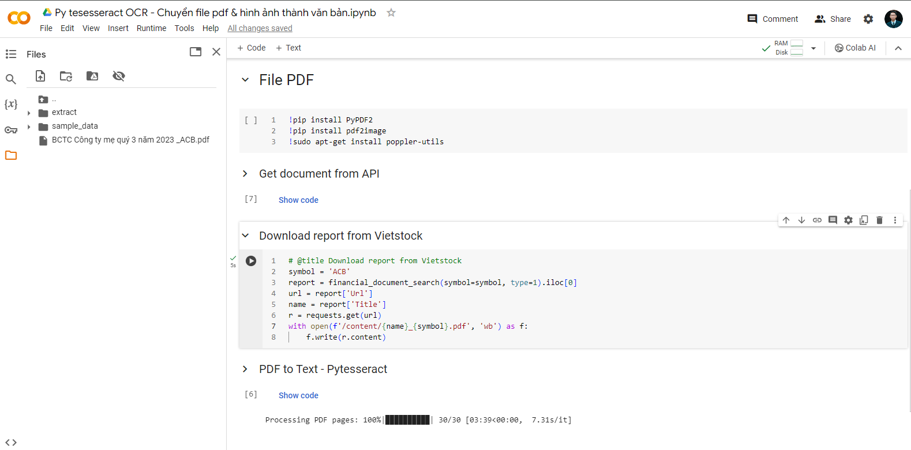

!!! abstract "Giới thiệu"
	[pytesseract](https://github.com/madmaze/pytesseract) là một thư viện Python giúp người dùng sử dụng công cụ Tesseract OCR của Google một cách dễ dàng. Tesseract là công cụ OCR mã nguồn mở, mạnh mẽ và hỗ trợ nhiều ngôn ngữ bao gồm tiếng Việt. Vnstock giới thiệu đến bạn cách thức nhận dạng văn bản từ hình ảnh với pytesseract từ đơn giản đến luồng tự động chuyển đổi toàn bộ tài liệu một cách dễ dàng từ Google Colab.

PyTesseract có thể được sử dụng để trích xuất văn bản từ tất cả các định dạng hình ảnh được hỗ trợ bởi gói thư viện [Pillow](https://github.com/python-pillow/Pillow) và [Leptonica](https://github.com/DanBloomberg/leptonica), bao gồm `JPEG`, `PNG`, `GIF`, `BMP`, `TIFF`, v.v.

PyTesseract có thể được sử dụng trong nhiều ứng dụng khác nhau, cụ thể với lĩnh vực tài chính/chứng khoán thì bạn có thể chuyển đổi tài liệu scan sang văn bản kỹ thuật số đối với các tài liệu phổ biến như:

- Báo cáo tài chính của công ty niêm yết
- Báo cáo thường niên
- Báo cáo quản trị
- Giải trình kết quả kinh doanh
- Tài liệu ĐHĐCĐ
- Bản cáo bạch

Các tài liệu scan này, bạn có thể dễ dàng tìm thấy trên Vietstock hoặc CafeF. 

👇 Bạn có thể bắt đầu với Demo Notebook dưới đây, đọc thêm chi tiết để đảm bảo bạn có thể sử dụng dễ dàng.

[Mở Demo Notebook :material-rocket-launch:](https://colab.research.google.com/github/thinh-vu/vnstock/blob/beta/docs/pytesseract_ocr_demo.ipynb){ .md-button }

Tính năng này hiện tại đã được cập nhật lên mã nguồn, nhánh `beta` trên Github. Xem hướng dẫn cài đặt [tại đây](https://docs.vnstock.site/start/huong-dan-cai-dat-vnstock-python/#xac-inh-phien-ban-phu-hop)
## Cài đặt môi trường

### Google Colab & Linux

!!! tip "Cài đặt áp dụng cho môi trường Linux"
	Cài đặt môi trường để chạy Pytesseract từ Google Colab trên nền hệ điều hành Ubuntu diễn ra khá đơn giản.

Bạn copy các dòng lệnh sau và paste vào một ô lệnh mới để thực thi:

```python
!sudo apt install tesseract-ocr
!pip install pytesseract
!sudo apt-get install tesseract-ocr-vie # Cài đặt gói ngôn ngữ tiếng Việt
```

Quá trình cài đặt diễn ra trong khoảng 30 giây.
### Windows

!!! tip "Cài đặt áp dụng cho môi trường Linux"
	Để chạy được Pytesseract từ máy tính Windows, quá trình cài đặt sẽ phức tạp hơn đôi chút.

1. Truy cập trang Github [UB Mannheim](https://github.com/UB-Mannheim/tesseract/wiki) để tải file cài đặt cho hệ điều hành Windows, chọn phiên bản 64bit hoặc 32bit phù hợp với máy của bạn. Link download như trong hình mô tả sau:



2. Mở file cài đặt có định dạng đuôi `.exe` là bắt đầu quá trình cài đặt, mọi tùy chọn để mặc định, bấm Next là được. Bạn chú ý ghi nhớ địa chỉ cài đặt Tesseract-OCR trên máy tính trong quá trình cài đặt. 
3. Cài đặt gói dữ liệu đã đào tạo sẵn để nhận dạng tiếng Việt. Bạn có thể lựa chọn gói ngôn ngữ được hỗ trợ [tại đây](https://github.com/tesseract-ocr/tessdata). Mặc định hệ thống đã được cài sẵn bộ dữ liệu tiếng Anh. Tải dữ liệu đào tạo cho tiếng Việt [tại link này](https://github.com/tesseract-ocr/tessdata/blob/main/vie.traineddata). Chọn icon download :octicons-download-16: ở góc bên phải.
4. Chép file `vie.traineddata` mới vừa tải về vào thư mục Tesseract-OCR. Từ thư mục chứa file bạn lưu, ví dụ Downloads, nhập `cmd` vào ô địa chỉ thư mục để mở giao diện dòng lệnh và chạy lệnh di chuyển file dưới đây. Trong đó, bạn thay thế `{USER_NAME_CUA_BAN}` thành tên username trên máy tính của bạn. Ví dụ trên máy tính của mình thì user name là `mrthi` như trong các hình minh họa bên dưới.
```
move vie.traineddata C:\Users\{USER_NAME_CUA_BAN}\AppData\Local\Programs\Tesseract-OCR\tessdata   
```
<figure markdown>
  
  <figcaption>Mở Command Prompt từ File Explorer</figcaption>
</figure>

<figure markdown>
  
  <figcaption>Di chuyển file trong Command Prompt</figcaption>
</figure>
## Pytesseract OCR căn bản với một hình ảnh tài liệu

Bạn chỉ cần nạp hàm được cung cấp bởi vnstock để thực hiện nhận diện ảnh thành văn bản như sau. Trong đó `image_path` là địa chỉ file ảnh cần nhận dạng.

```python
from vnstock.ocr import *
image_ocr(image_path=r'/content/chrome_runiB0dpB3.png', lang='vie', output_path='', file_name='string_from_image.txt')
```

Các tham số khác như sau:

- `output_path`: địa chỉ lưu file văn bản đã nhận dạng từ hình ảnh
- `file_name`: đặt tên file văn bản sẽ lưu. Mặc định là: `string_from_image.txt`
### Nhận diện văn bản từ ảnh

Sau khi các bước thiết lập môi trường đã chuẩn bị xong. Bạn có thể upload hình ảnh lên 



Như vậy, chúng ta có thể bắt đầu trích xuất văn bản từ hình ảnh vừa upload với câu lệnh sau:
```python
extracted_text = pytesseract.image_to_string(Image.open('/content/chrome_runiB0dpB3.png'), lang='vie')
extracted_text
```

Để lưu văn bản đã trích xuất thành file text, bạn có thể dùng câu lệnh dưới đây:

```python
with open('extracted_text.txt', 'w') as f: # Mặc định lưu file vào thư mục đang làm việc của Colab, bị xóa khi kết thúc phiên. Chọn địa chỉ lưu trong Drive để thay thế.
    f.write(extracted_text)
```

## 🔐 Trích xuất toàn bộ văn bản từ báo cáo tài chính

!!! tip "Chương trình viết sẵn"
	Bạn cần tham gia gói **vnstock-data-pro** thông qua [Vnstock Insiders Program](http://localhost:8000/insiders-program/gioi-thieu-chuong-trinh-vnstock-insiders-program/) để có thể trích xuất toàn bộ một tài liệu bất kỳ hoặc báo cáo tài chính của công ty bạn quan tâm sử dụng chương trình viết sẵn từ vnstock giúp tự động hóa hoàn toàn quá trình từ khâu truy cập tài liệu từ API. Sau khi tài trợ dự án, bạn nhận được quyền truy cập private repo trên Github để sử dụng kèm hướng dẫn chi tiết.



