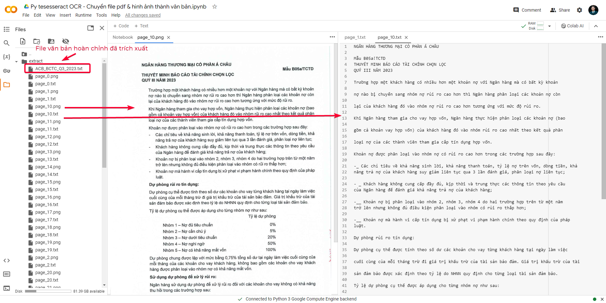

!!! abstract "Giới thiệu"
	[pytesseract](https://github.com/madmaze/pytesseract) là một thư viện Python giúp người dùng sử dụng công cụ Tesseract OCR của Google một cách dễ dàng. Tesseract là công cụ OCR mã nguồn mở, mạnh mẽ và hỗ trợ nhiều ngôn ngữ bao gồm tiếng Việt. Vnstock giới thiệu đến bạn cách thức nhận dạng văn bản từ hình ảnh với pytesseract từ đơn giản đến luồng tự động chuyển đổi toàn bộ tài liệu một cách dễ dàng từ Google Colab.

PyTesseract có thể được sử dụng để trích xuất văn bản từ tất cả các định dạng hình ảnh được hỗ trợ bởi gói thư viện [Pillow](https://github.com/python-pillow/Pillow) và [Leptonica](https://github.com/DanBloomberg/leptonica), bao gồm `JPEG`, `PNG`, `GIF`, `BMP`, `TIFF`, v.v.

PyTesseract có thể được sử dụng trong nhiều ứng dụng khác nhau, cụ thể với lĩnh vực tài chính/chứng khoán thì bạn có thể chuyển đổi tài liệu scan sang văn bản kỹ thuật số đối với các tài liệu phổ biến như:

- Báo cáo tài chính của công ty niêm yết
- Báo cáo thường niên
- Báo cáo quản trị
- Giải trình kết quả kinh doanh
- Tài liệu ĐHĐCĐ
- Bản cáo bạch

Các tài liệu scan này, bạn có thể dễ dàng tìm thấy trên Vietstock hoặc CafeF.

## Pytesseract OCR căn bản với một hình ảnh tài liệu

[Mở Demo Notebook :material-rocket-launch:](https://colab.research.google.com/github/thinh-vu/vnstock/blob/beta/docs/pytesseract_ocr_demo.ipynb){ .md-button }

Cụ thể các bước thực hiện được giải thích dưới đây.

### Cài đặt môi trường

!!! tip "Cài đặt áp dụng cho môi trường Linux"
	Cài đặt môi trường để chạy Pytesseract từ Google Colab trên nền hệ điều hành Ubuntu diễn ra khá đơn giản.

Bạn copy các dòng lệnh sau và paste vào một ô lệnh mới để thực thi:

```python
!sudo apt install tesseract-ocr
!pip install pytesseract
!sudo apt-get install tesseract-ocr-vie # Cài đặt gói ngôn ngữ tiếng Việt
```

Quá trình cài đặt diễn ra trong khoảng 30 giây. Sau đó, bạn nạp các thư viện vào môi trường làm việc với đoạn lệnh sau:

```python
import pytesseract
try:
    from PIL import Image
except ImportError:
    import Image
```

### Nhận diện văn bản từ ảnh

Sau khi các bước thiết lập môi trường đã chuẩn bị xong. Bạn có thể upload hình ảnh lên 


Như vậy, chúng ta có thể bắt đầu trích xuất văn bản từ hình ảnh vừa upload với câu lệnh sau:
```python
extracted_text = pytesseract.image_to_string(Image.open('/content/chrome_runiB0dpB3.png'), lang='vie')
extracted_text
```

Để lưu văn bản đã trích xuất thành file text, bạn có thể dùng câu lệnh dưới đây:

```python
with open('extracted_text.txt', 'w') as f: # Mặc định lưu file vào thư mục đang làm việc của Colab, bị xóa khi kết thúc phiên. Chọn địa chỉ lưu trong Drive để thay thế.
    f.write(extracted_text)
```

## 🔐 Trích xuất toàn bộ văn bản từ báo cáo tài chính

!!! tip "Chương trình viết sẵn"
	Bạn cần tham gia gói **vnstock-data-pro** thông qua [Vnstock Insiders Program](http://localhost:8000/insiders-program/gioi-thieu-chuong-trinh-vnstock-insiders-program/) để có thể trích xuất toàn bộ một tài liệu bất kỳ hoặc báo cáo tài chính của công ty bạn quan tâm sử dụng chương trình viết sẵn từ vnstock giúp tự động hóa hoàn toàn quá trình từ khâu truy cập tài liệu từ API. Sau khi tài trợ dự án, bạn nhận được quyền truy cập private repo trên Github để sử dụng kèm hướng dẫn chi tiết.


